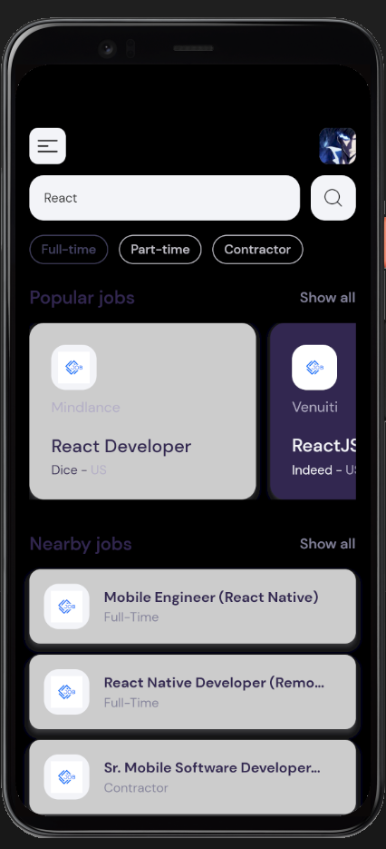
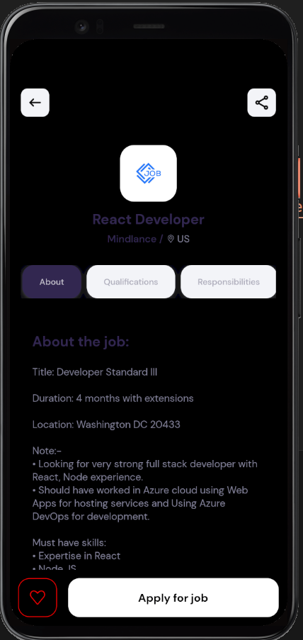
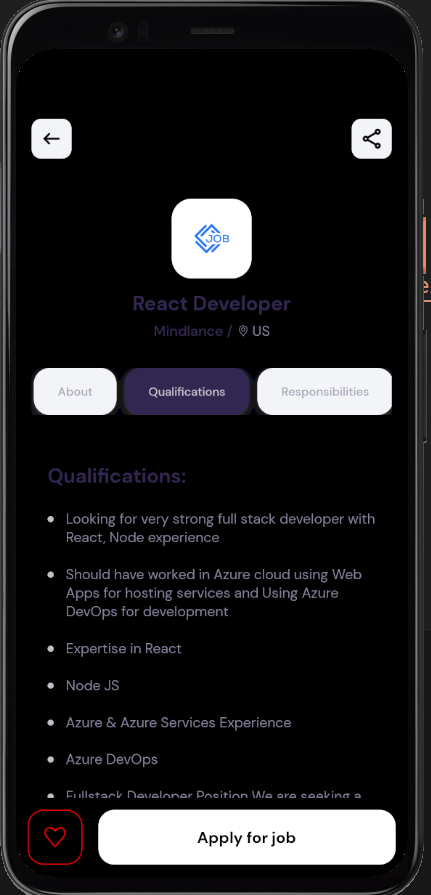
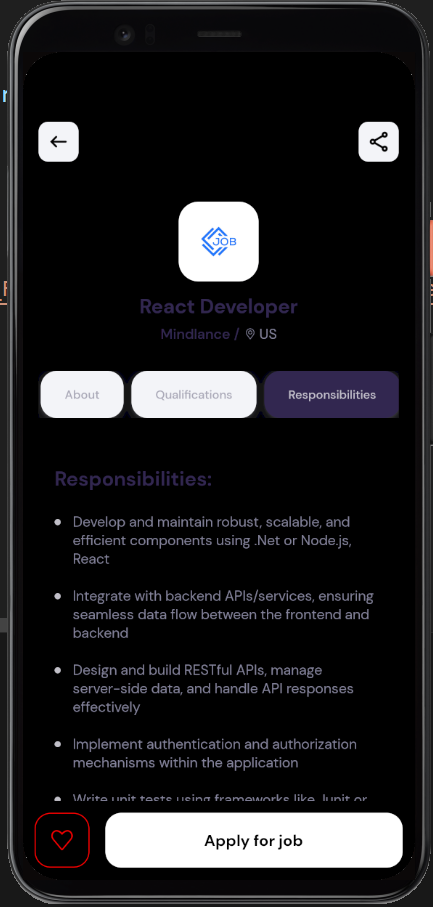
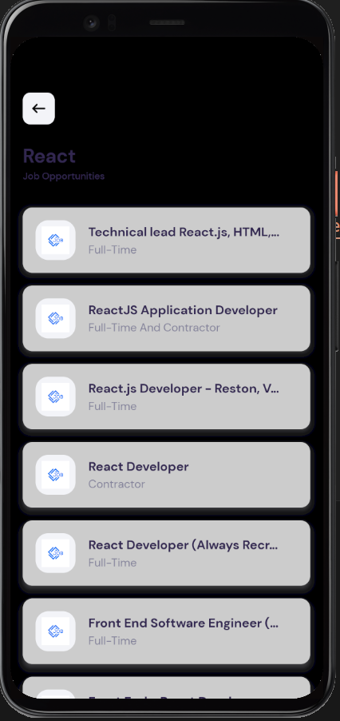

# JobSift

JobSift is a React Native mobile application built to showcase my mobile development skills and my ability to work with APIs. The app helps users discover and apply for jobs using the [JSearch API](https://rapidapi.com/letscrape-6bRBa3QguO5/api/jsearch) from RapidAPI. It features a modern, intuitive interface for browsing popular and nearby jobs, searching by keyword or type, and viewing detailed job information.

## Features

- 🔍 **Search Jobs:** Find jobs by keyword or job type (Full-time, Part-time, Contractor).
- 🏆 **Popular & Nearby Jobs:** Browse curated lists of popular and nearby job postings.
- 📄 **Job Details:** View comprehensive job descriptions, qualifications, and responsibilities.
- ❤️ **Save Jobs:** Like jobs for quick access (UI only).
- 📱 **Responsive UI:** Clean, mobile-first design with custom fonts and icons.
- 🌐 **Pagination:** Easily navigate through multiple pages of search results.

## Screenshots


> 
> 
> 
> 
> 

## Getting Started

This project is designed to be easy to set up and run on your local machine.

### Prerequisites

- [Node.js](https://nodejs.org/)
- [Expo CLI](https://docs.expo.dev/get-started/installation/)
- [Yarn](https://yarnpkg.com/) or [npm](https://www.npmjs.com/)
- A [RapidAPI](https://rapidapi.com/) account and a JSearch API key

### Installation

1. **Clone the repository:**
   ```sh
   git clone https://github.com/lribeiro20/jobsift.git
   cd jobsift
   ```

2. **Install dependencies:**
   ```sh
   npm install
   # or
   yarn install
   ```

3. **Set up your environment variables:**
   - Create a `.env` file in the root directory.
   - Add your RapidAPI key:
     ```
     RAPIDAPI_KEY=your_rapidapi_key_here
     ```

4. **Start the development server:**
   ```sh
   npm start
   # or
   yarn start
   ```

5. **Run the app:**
   - Use the Expo Go app on your mobile device to scan the QR code, or
   - Press `a` to open on Android emulator, `i` for iOS simulator.

---

> This project demonstrates my ability to build modern mobile apps and integrate third-party APIs. Feel free to explore, fork, or reach out for collaboration!